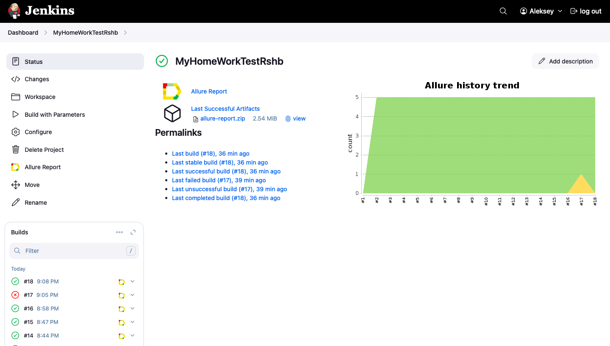
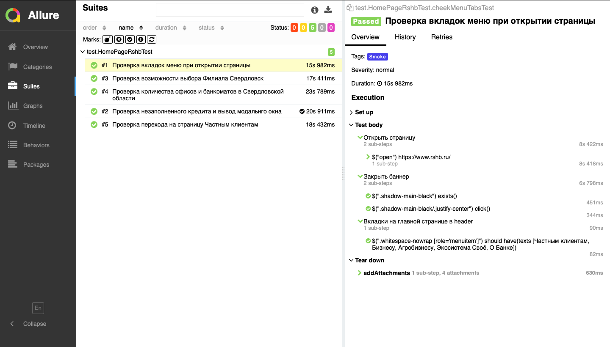
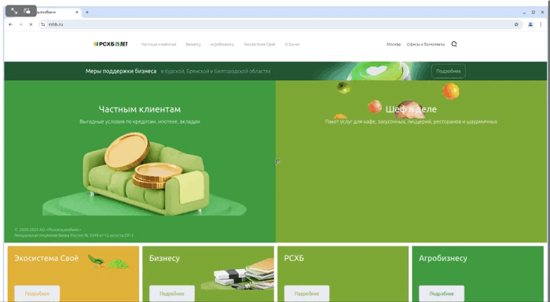
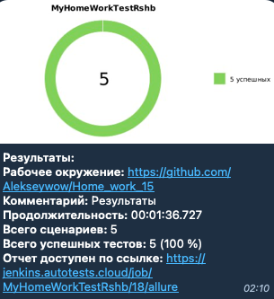

# Автоматизация сайта Россельхоз Банк
[Россельхоз Банк](https://www.rshb.ru/)

---

## 📄 Проект включает в себя:

---
Технологии и инструменты  
Реализованные проверки   
Сборка в Jenkins  
Параметры сборки в Jenkins  
Пример Allure отчета  
Уведомления в Telegram с использованием бота

## 💻 Технологии и инструменты:

---

 <a href="https://www.jetbrains.com/idea/">

## ✅ Реализованные проверки:

---
Проверка вкладок меню при открытии главной страницы  
Проверка возможности выбора филиала Свердловск  
Проверка количества офисов и банкоматов в Свердловской области  
Проверка перехода на страницу Частные клиенты  
Проверка незаполненного кредита и вывод модельного окна

## ▶️ Сборка в Jenkins:

---
Перейти по [ссылке](https://jenkins.autotests.cloud/job/MyHomeWorkTestRshb/)  

Для запуска сборки необходимо кликнуть на "Build with parameters"  

  

## 🏷️ Параметры сборки в Jenkins:

---
browser (браузер, по умолчанию chrome)  
browserVersion (версия браузера, по умолчанию 127)  
browserSize (размер окна браузера, по умолчанию 1920x1080)

## 📊 Пример отчета в Allure:

---
Для просмотре перейти по [ссылке](https://jenkins.autotests.cloud/job/MyHomeWorkTestRshb/18/allure/)  
Результаты выполнения тестов:  

  

Видео с результатом одного выполненного теста:

  

## 🔔 Уведомление в Telegram с использованием бота:

---
После завершения сборки Telegram-бот автоматически обрабатывает и отправляет сообщение с отчетом о прогоне тестов

  
